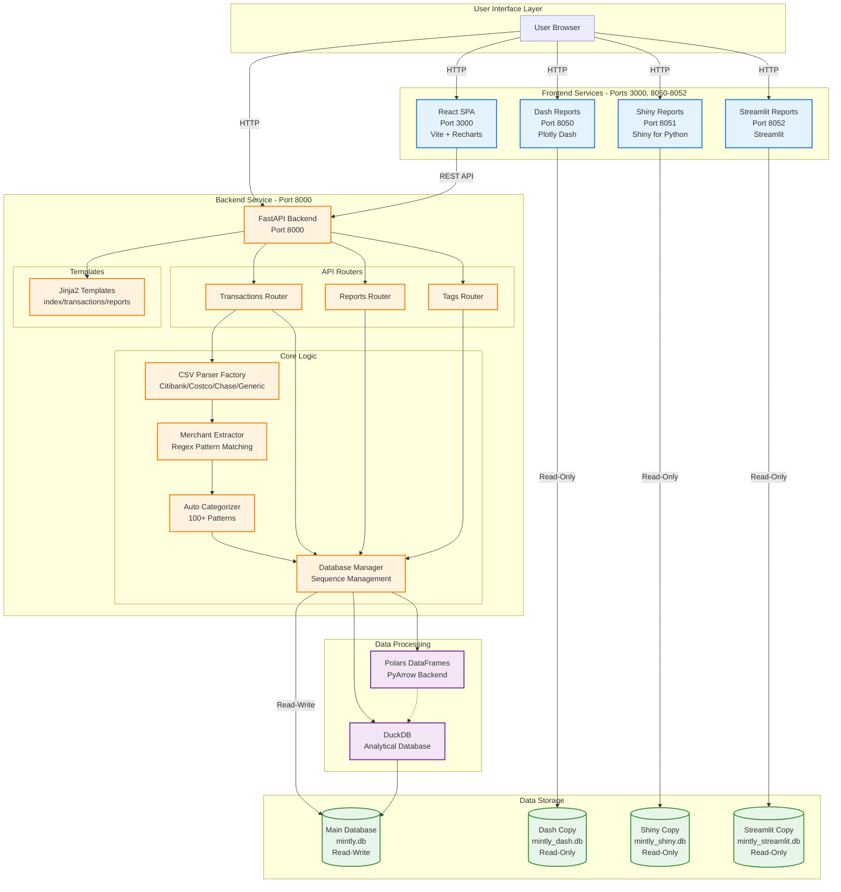
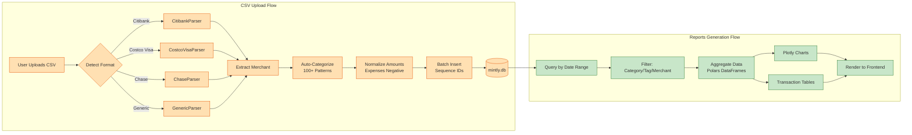
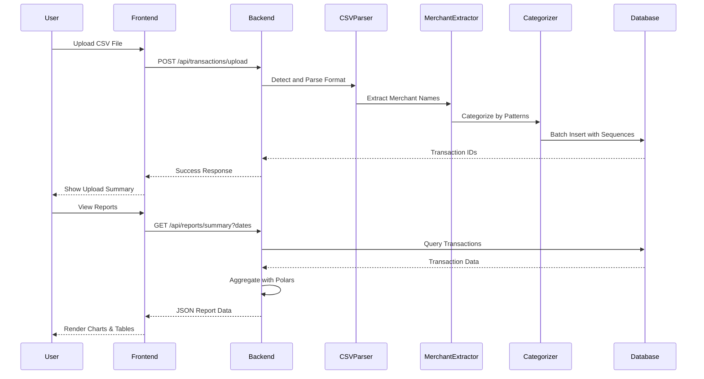
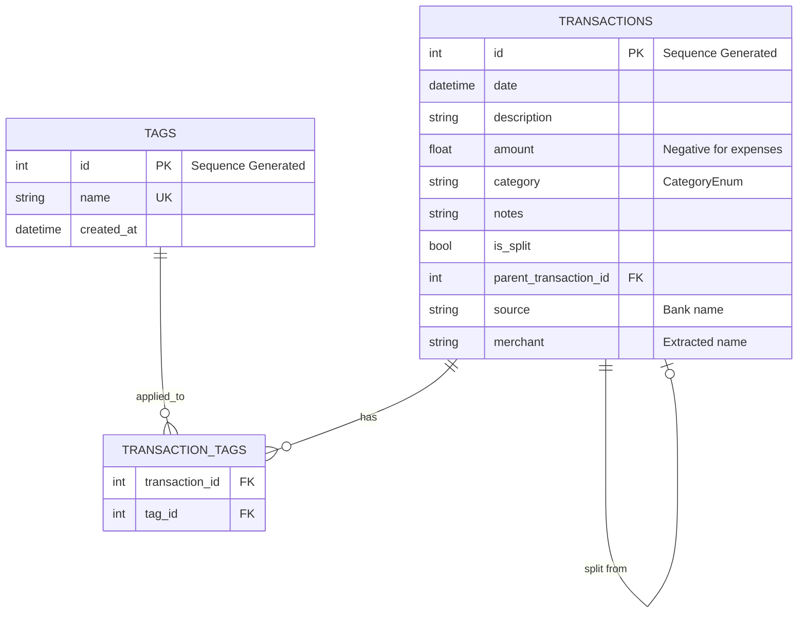
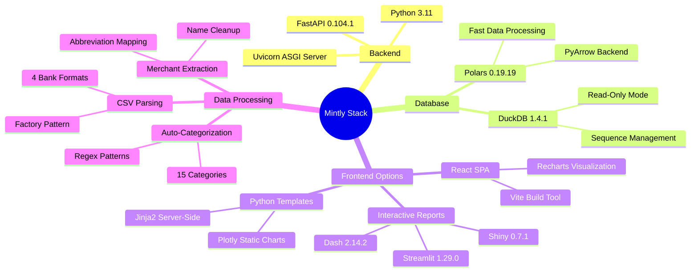
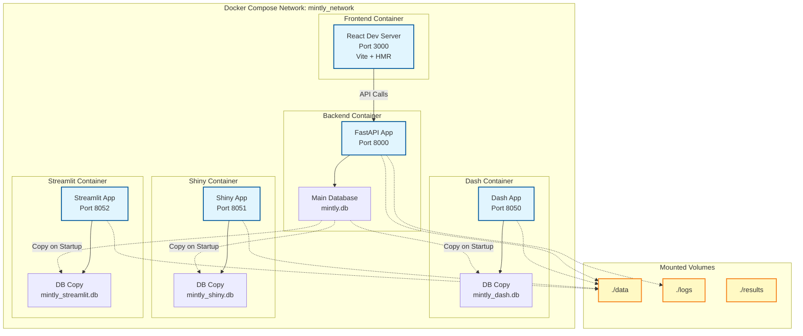

# Mintly Application Architecture

This document provides a comprehensive overview of the Mintly budgeting application architecture.

## System Architecture Diagram



## Data Flow Diagram



## Component Interaction Diagram



## Database Schema



## Technology Stack



## Deployment Architecture



## Key Architectural Patterns

### 1. Factory Pattern (CSV Parsing)
```
CSVParserFactory
  ├── CostcoVisaParser
  ├── CitibankParser
  ├── ChaseParser
  └── GenericParser
```

### 2. Singleton Pattern (Database Manager)
```
DatabaseManager (Single Instance)
  ├── Connection Pool Management
  ├── Sequence Generation
  └── Read-Only Mode Support
```

### 3. Strategy Pattern (Categorization)
```
Categorizer
  ├── Pattern Matching Strategy
  ├── 15 Category Enums
  └── 100+ Regex Rules
```

### 4. Repository Pattern (Data Access)
```
DatabaseManager
  ├── get_transactions_by_date_range()
  ├── insert_transactions_batch()
  ├── get_category_summary()
  └── tag_management()
```

## Port Allocation

| Service | Port | Protocol | Purpose |
|---------|------|----------|---------|
| Backend | 8000 | HTTP | REST API & Server-Rendered UI |
| React | 3000 | HTTP | Modern SPA Frontend |
| Dash | 8050 | HTTP | Python Interactive Reports |
| Shiny | 8051 | HTTP | Reactive Reports (R-style) |
| Streamlit | 8052 | HTTP | Data Science Reports |

## Security Considerations

1. **Database Isolation**: Read-only copies prevent concurrent write conflicts
2. **Input Validation**: Pydantic models validate all API inputs
3. **CSV Sanitization**: Parser validates date formats and numeric values
4. **Amount Normalization**: Prevents injection via amount manipulation
5. **Category Enum**: Restricts categories to predefined safe values

## Performance Optimizations

1. **Caching Strategies**:
   - Streamlit: `@st.cache_data`, `@st.cache_resource`
   - Shiny: `@reactive.calc` for computed values
   - Backend: Polars lazy evaluation

2. **Batch Processing**:
   - CSV uploads processed in bulk
   - Sequence IDs generated in batch
   - Database inserts use batch operations

3. **Database Copies**:
   - Prevents read locks on main database
   - Each reporting service has dedicated copy
   - Refresh on service restart

## Future Architecture Considerations

- **Horizontal Scaling**: Add load balancer for multiple backend instances
- **Database Replication**: PostgreSQL or distributed DuckDB
- **Message Queue**: Async CSV processing with Celery/RabbitMQ
- **Caching Layer**: Redis for session state and query results
- **API Gateway**: Kong or Traefik for unified API management
